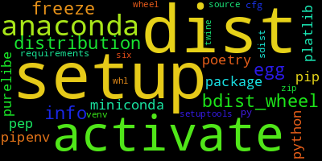
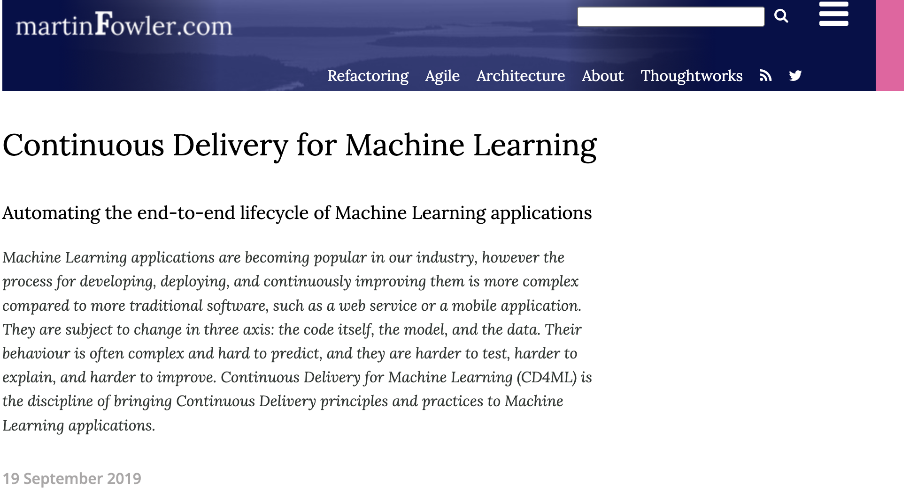
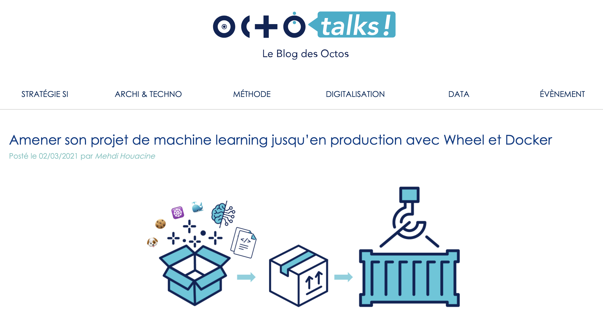

## Packaging <br>d'une application <br>de Machine Learning 


<!--s-->

## `$>` [Whoami](https://www.linkedin.com/in/mehdihouacine/) ❓

<style>
#whoami td, #whoami th {
  border: none;
}
</style>

<!--v-->

<!-- .slide: data-background="https://www.octo.com/wp-content/uploads/2019/03/expertises-OCTO.jpg.webp" class="white-text" -->

<div style="position: absolute; width: 40%; right: 0; box-shadow: 0 1px 4px rgba(0,0,0,0.5), 0 5px 25px rgba(0,0,0,0.2); background-color: rgba(255, 255, 255); padding: 20px; font-size: 20px; text-align: center;">
  <h2>Consultant @ OCTO depuis 2017</h2>
  
</div>

<!--v-->

<!-- .slide: data-background="https://images.unsplash.com/photo-1554475901-4538ddfbccc2?ixlib=rb-1.2.1&ixid=MnwxMjA3fDB8MHxwaG90by1wYWdlfHx8fGVufDB8fHx8&auto=format&fit=crop&w=2372&q=80" class="white-text" -->

<div style="position: absolute; width: 40%; right: 0; box-shadow: 0 1px 4px rgba(0,0,0,0.5), 0 5px 25px rgba(0,0,0,0.2); background-color: rgba(0, 0, 0, 0.9); padding: 20px; font-size: 20px; text-align: center;">
  <h2 style="color: white;">Touche-à-tout ⚗️</h2>
  <p style="color: white;">Dév backend, frontend, Machine Learning, sécurité, design d'expérience (UX)...</p>
</div>

<!--v-->

<!-- .slide: data-background="https://images.unsplash.com/photo-1524178232363-1fb2b075b655?ixlib=rb-1.2.1&ixid=MnwxMjA3fDB8MHxwaG90by1wYWdlfHx8fGVufDB8fHx8&auto=format&fit=crop&w=2370&q=80" class="white-text" -->

<div style="position: absolute; width: 40%; left: 0; box-shadow: 0 1px 4px rgba(0,0,0,0.5), 0 5px 25px rgba(0,0,0,0.2); background-color: rgba(0, 0, 0, 0.9); padding: 20px; font-size: 20px; text-align: center;">
  <h2 style="color: white;">Instructeur de formation 🚸</h2>
  <p style="color: white;">Agilité, MLOps, Data Science, <br>Automatisation d'infrastructure, Cloud</p>
</div>

<!--v-->


Co-organisateur de ce Meetup ♥️


<!--s-->

## Avez-vous déjà ...

... mis en prod' une application de ML ?

🧠 ➕ 📦 = 🤔 

Note: TODO sondage Mentimeter

<!--s-->

<!-- .slide: data-background="./images/lalit-kumar-HpPmiduLDC0-unsplash.jpg" class="white-text" -->

<!--v-->

## Détection de <br>défauts de qualité

### 🧠 + 📸 = 💰

 <!-- .element: class="fragment" -->

<!--v-->

<!-- .slide: data-background="https://media.giphy.com/media/J1Xh064pPyRWcNYaj6/giphy.gif" class="white-text" -->

<div style="position: absolute; width: 40%; right: 0; box-shadow: 0 1px 4px rgba(0,0,0,0.5), 0 5px 25px rgba(0,0,0,0.2); background-color: rgba(0, 0, 0, 0.9); padding: 20px; font-size: 20px; text-align: center;"><h2 style="color:white;">Quelques cas d'usages</h2><p>🏭 🏭 🏭 </p></div>


<!--v-->

## Défauts sur textile

|                                                 un bon pli                                                 |                                                un mauvais pli                                                |
| :--------------------------------------------------------------------------------------------------------: | :----------------------------------------------------------------------------------------------------------: |
|  |  |

<!--v-->

## Défauts sur textile

|                                                 un bon pli                                                 |                                                     un mauvais pli                                                     |
| :--------------------------------------------------------------------------------------------------------: | :--------------------------------------------------------------------------------------------------------------------: |
|  |  |

<!--v-->

## Et en vrac ...

|                                Présence de composants                                 |                                    Etat de soudures                                    |                                  Détection de rayures                                  |
| :-----------------------------------------------------------------------------------: | :------------------------------------------------------------------------------------: | :------------------------------------------------------------------------------------: |
|  |  |  |


<!--s-->

<!-- .slide: data-background="https://images.unsplash.com/photo-1598983870677-01e066a0b901?ixlib=rb-1.2.1&ixid=MnwxMjA3fDB8MHxwaG90by1wYWdlfHx8fGVufDB8fHx8&auto=format&fit=crop&w=2370&q=80" class="white-text" -->


<h3 style="color: white;">La modélisation dure plus d'1 an</h3>

<!--v-->

#### Ce qu'on aurait peut-être dû faire 😁

#### [Google Rule of ML #4](https://developers.google.com/machine-learning/guides/rules-of-ml?hl=fr#rule_4_keep_the_first_model_simple_and_get_the_infrastructure_right) 

> *Keep the first model simple <br>and get the infrastructure right*

<!--v-->

### Au bout d'1 an

#### On fait enfin notre première démo en usine 💪


<!--v-->

<!-- .slide: data-background="images/asli-yilmaz-u1PX1Q26Kpo-unsplash.jpg" -->

<div style="position: absolute; width: 40%; right: 0; box-shadow: 0 1px 4px rgba(0,0,0,0.5), 0 5px 25px rgba(0,0,0,0.2); background-color: rgba(0, 0, 0, 0.9); padding: 20px; font-size: 20px; text-align: center;">
  <h4 style="color:white;">La démo convainct ✅</h4>
  <h4 style="color:white;">On a le Go pour aller en prod ! 🗺 🏭</h4>
  <h4 style="color:white;">Et même pour passer à l'échelle ! 🪜 🪜</h4>
</div>

<!--s-->

<!-- .slide: data-background="https://images.unsplash.com/photo-1613464789351-24b80d158795?ixlib=rb-1.2.1&ixid=MnwxMjA3fDB8MHxwaG90by1wYWdlfHx8fGVufDB8fHx8&auto=format&fit=crop&w=2370&q=80" -->

<h2 style="color: white">Prenons du recul</h2>

<!--v-->


<small>Il nous a fallu plus d'1 an pour adresser la petite boîte noire 🙀</small>
<small>C'est du temps qu'on aurait pu consacrer à autre chose que la modélisation</small>
<small>(*Source : [Hidden Technical Debt in Machine Learning Systems](https://proceedings.neurips.cc/paper/2015/file/86df7dcfd896fcaf2674f757a2463eba-Paper.pdf)*)</small>

<!--v-->

### Ce qu'on fait bien

### à ce moment-là ✅

- 🐍 Tests automatisés avec Pytest,
- 📏 Bonnes métriques de qualité de code,
  - *Code coverage*, [Pyramide de tests](https://blog.octo.com/la-pyramide-des-tests-par-la-pratique-1-5/), ...
- 🦊 Pipeline `Gitlab-CI` de tests auto.


<!--v-->

## Là où ça pêche ❌

### Mode d'emploi pour déployer

- 🛫 Prendre l'avion dans l'usine cible
  - 24h avant l'échéance contractuelle

<!--v-->

## Là où ça pêche ❌

### Mode d'emploi pour déployer

- 🛠 Passer la journée à configurer le "PC de prod'"
  - 🐧Clean install' Linux
  - 🐍 Bonne version de Python,
  - ⚙️ Bons drivers GPU

<!--v-->

## Là où ça pêche ❌

### Mode d'emploi pour déployer

- `$> git clone;` du repo où sont versionnés :
  - le code de ML, le code métier
  - 🧠 et le modèle

<!--v-->

## Constat 🛫

Sans investir dans l'automatisation,

L'équipe passera son temps <br>en déplacement pour déployer 💸

<!--v-->

## On commence à automatiser

- J'ai un mois pour automatiser le setup
  - 🐧Clean install' Linux
  - 🐍 Bonne version de Python,
  - ⚙️ Bons drivers GPU

- Je ne comprends rien au packaging en Python 🤷



<!--v-->

<!-- .slide: data-background="https://media0.giphy.com/media/e24Q8FKE2mxRS/giphy.gif" -->

<!--s-->

<!-- .slide: data-background="https://images.unsplash.com/photo-1600009723480-ae9ee0a74709?ixlib=rb-1.2.1&ixid=MnwxMjA3fDB8MHxwaG90by1wYWdlfHx8fGVufDB8fHx8&auto=format&fit=crop&w=987&q=80" -->

<h2 style="color: white">Repartons <br>des bases du packaging</h2>

<!--v-->

#### C'est quoi une app de Machine learning ?

<a href="https://martinfowler.com/articles/cd4ml.html">
    
</a>

<small>*Source : [Continuous Delivery for Machine Learning](https://martinfowler.com/articles/cd4ml.html)*</small>


<!--v-->

### J'ai commencé simple ...

### J'ai commencé par un zip

```bash
.PHONY: package  ## 📦 packaging de l'application en zip
package:
  zip -r object-detector.zip \
    ${path_to_code} ${path_to_model} ${path_to_data}
```

```bash
.PHONY: install-app  ## ⚙️ Code arbitraire à exécuter chez vous si vous voulez vous servir de cette application
install-app: MY_OS := 'centOS'
  unzip object-detector.zip -d ${SITE_PACKAGES_DESTINATION_PATH}
  # Here be dragons 🐉🐉🐉 ...
  mv ${SERVICE_FILE} ${SERVICE_PATH}
  $(MAKE) compilation_en_c OS=${MY_OS}
```

<!--v-->

## Packaging avec un zip

- ✅ C'est simple, pratique, tout tient dans 1 archive

### Mais

- ❌ Exécution de code arbitraire <!-- .element: class="fragment" -->
- ❌ C'est de la maintenance en + <!-- .element: class="fragment" -->
- ❌ On se passe des outils standards proposés par l'éco-système Python <!-- .element: class="fragment" -->

<!--v-->

<!-- .slide: data-background="./images/roberto-sorin-ZZ3qxWFZNRg-unsplash.jpg" -->

<div style="position: absolute; width: 40%; right: 0; box-shadow: 0 1px 4px rgba(0,0,0,0.5), 0 5px 25px rgba(0,0,0,0.2); background-color: rgba(0, 0, 0, 0.9); padding: 20px; font-size: 20px; text-align: center;">
  <h2 style="color:white;">🔋 batteries <a href="https://peps.python.org/pep-0206/#batteries-included-philosophy">included</a></h2>
  <p style="color:white;">L'éco-système Python se veut "auto-portant", en mettant à disposition des outils prêt à l'emploi pour permettre son plein usage</p>
</div>

<!--s-->

<!-- .slide: data-background="https://images.unsplash.com/photo-1548741465-8b453e363e48?ixlib=rb-1.2.1&ixid=MnwxMjA3fDB8MHxwaG90by1wYWdlfHx8fGVufDB8fHx8&auto=format&fit=crop&w=2274&q=80" -->

<div style="position: absolute; width: 70%; left: 10%; box-shadow: 0 1px 4px rgba(0,0,0,0.7), 0 5px 25px rgba(0,0,0,0.5); background-color: rgba(0, 0, 0, 0.7); padding: 20px; font-size: 20px; text-align: center;">
  <h2 style="color:white;">
    🐍 Le format Wheel ☸️
  </h2>
  <h3 style="color:white;">
    Pour éviter de réinventer la roue 🥁🥁🥁
  </h3>
</div>

<!--v-->

<!-- .slide: data-background-iframe="https://packaging.python.org/en/latest/discussions/wheel-vs-egg/#:~:text=Wheel%20is%20currently%20considered%20the%20standard%20for%20built%20and%20binary%20packaging%20for%20Python." -->

<div style="position: absolute; width: 40%; right: 0; box-shadow: 0 1px 4px rgba(0,0,0,0.5), 0 5px 25px rgba(0,0,0,0.2); background-color: rgba(0, 0, 0, 0.9); padding: 20px; font-size: 20px; text-align: center;"><p style="color:white;">Wheel est le seul format officiellement préconisé à ce jour par <br>la <a href="https://www.pypa.io/en/latest/">Python Packaging Authority (PyPA)</a></p></div>

<!--v-->

🐍 Le format Wheel est un format de *packaging*, <br>et un <span style="text-decoration: underline;">**package**</span> c'est :


| Propriété                                      | Example                |
| :--------------------------------------------- | :--------------------- |
| Une **version**                                | `v1.4.1`               |
| Le **code**                                    | code ML \| métier      |
| Des **metadata** <br>pour le *package manager* | pip \| apt \| yum      |
| Le tout dans une **archive**                   | zip \| tar.gz \| bzip2 |

<!--v-->

## Comment ça marche ?

- Les distributions Wheel se publient dans un dépôt :
  - le *Python Package Index* ([PyPI](https://pypi.org/)),
- 📦📦 Elles se génèrent avec la librairie [setuptools](https://pypi.org/project/setuptools/), 
- ↗️☁️ Elles se publient dans PyPI via la librairie [twine](https://pypi.org/project/twine/)
- ⬇️💻 Et se téléchargent avec la librairie [pip](https://pypi.org/project/pip/)


<!--v-->

## Le setup, avec `setup.py`

```python
from setuptools import setup

setup(
  name='Distutils',
  version='1.0',
  description='🧠 ➕ 📦 = ❤️',
  author='Crafting Datascience',
  author_email='crafting.datascience@gmail.com',
  url='https://www.meetup.com/fr-FR/crafting-datascience/',
  packages=['distutils', 'distutils.command', ...],
)
```

<!--v-->

## Le setup, avec `setup.cfg`

> Parce que décrire de la configuration avec du code exécutable,
> c'est la porte ouverte à toutes les fenêtres 🪟🪟🪟

<span style="float: right;">-- Mehdi H. 2022</span>

<!--v-->

## Le setup, avec `setup.cfg`

```python
# setup.py
from setuptools import setup

setup()
```

```toml
# setup.cfg
[metadata]
name = presentation-packaging-machine-learning
version = 1.0
author = Mehdi Houacine
author_email = mehdi.houacine@octo.com
home-page = https://github.com/Mehdi-H/presentation-packaging-machine-learning
license = <une licence in-croy-able>
description = <une description surprenante>
platform = any
classifiers =
   Programming Language :: Python :: 3
   Intended Audience :: Developers, DataScientists, MLEngineers
   Operating System :: OS Independent
   Bug Tracker = https://github.com/Mehdi-H/presentation-packaging-machine-learning/issues

[options]
zip_safe = false
packages = find:
install_requires =
   numpy==1.19.4
   tensorflow==2.4.0
include_package_data = True
python_requires = >=3.8

[options.entry_points]
console_scripts =
   pkg-ml = presentation_packaging_machine_learning.__main__:main
```

<!--v-->

## Le saviez-tu ? 💡

Le `setup` peut générer un package <br>[dans d'autres formats](https://docs.python.org/fr/3/distutils/sourcedist.html) que `.whl`

```python
$> python setup.py sdist --formats=gztar,zip;
```

- zip, gztar, bztar, xztar, ztar, tar, ...

<!--v-->

## Le saviez-tu ? 💡

🥸 Le format `wheel`, <br>**c'est un `zip` avec une moustache !**

> A wheel is a ZIP-format archive 
> with a specially formatted file name 
> and the .whl extension

<span style="float: right;">-- <a href="https://peps.python.org/pep-0427/#abstract">PEP-0427</a></span>

<!--v-->

## Le saviez-tu ? 💡

🥸 Le format `wheel`, <br>c'est un `zip` avec une moustache !

```shell
$> unzip -vl pandas-1.4.3-cp310-cp310-win_amd64.whl;


Archive:  pandas-1.4.3-cp310-cp310-win_amd64.whl
 Length   Method    Size  Cmpr    Date    Time   CRC-32   Name
--------  ------  ------- ---- ---------- ----- --------  ----
   10643  Defl:N     3493  67% 06-23-2022 12:34 d5770ab4  pandas/__init__.py
    8812  Defl:N     2956  67% 06-23-2022 12:34 cc32e406  pandas/_typing.py
     518  Defl:N      357  31% 06-23-2022 12:40 b1fb299d  pandas/_version.py
   46176  Defl:N    11329  76% 06-23-2022 12:34 3b2fefd0  pandas/conftest.py
     331  Defl:N      151  54% 06-23-2022 12:33 da86e406  pandas/testing.py
...
```

<!--v-->

## Packager du ML <br>au format Wheel

#### Démonstration 🥸

- 🧠 Un modèle de ML, c'est un fichier <small>(.pkl, .h5, ...)</small>

- ☸️ `Setuptools` permet d'embarquer <br>des fichiers dans un Wheel

- ⇒ **`Setuptools` permet de <br>packager du ML au format Wheel 🎉**

<!--v-->

## Step 1

### Setup.{py,cfg} 📝

```toml
[metadata]
name = presentation-packaging-machine-learning
version = 1.0
...

[options]
...
include_package_data = True  # 👈
```

<!--v-->

## Step 2

### MANIFEST.in 📝

```toml
# MANIFEST.in

## 👇
include models/densenet121_weights_tf_dim_ordering_tf_kernels.h5
```
<!--v-->

## Step 3

### Build 🔨

```python
$> python setup.py bdist_wheel;
```

[ou même mieux](https://peps.python.org/pep-0517/), pour les *cool kids* <small>(PEP 517)</small>

```python
$> python -m build --wheel;
```
<!--v-->

## Test de recette

- [x] Présence du modèle dans le .whl

```shell
$> unzip -vl dist/presentation_packaging_model-1.0-py3-none-any.whl

Archive:  dist/presentation_packaging_model-1.0-py3-none-any.whl
 Length   Method    Size  Cmpr    Date    Time   CRC-32   Name
--------  ------  ------- ---- ---------- ----- --------  ----
       0  Defl:N        2   0% 07-03-2022 11:58 00000000  presentation_pkg_ml/__init__.py
🚀 34115984  Defl:N 30329718  11% 07-01-2022 19:53 b0ae32e5  presentation_pkg_ml/densenet121_weights_tf_dim_ordering_tf_kernels.h5
     509  Defl:N      287  44% 07-03-2022 12:10 65037a2e  presentation_pkg_ml/main.py
     559  Defl:N      315  44% 07-03-2022 12:11 a9a8970e  presentation_packaging_model-1.0.dist-info/METADATA
      92  Defl:N       92   0% 07-03-2022 12:11 801a68e9  presentation_packaging_model-1.0.dist-info/WHEEL
      79  Defl:N       68  14% 07-03-2022 12:11 494ecc87  presentation_packaging_model-1.0.dist-info/entry_points.txt
      20  Defl:N       22 -10% 07-03-2022 12:11 5faa91fa  presentation_packaging_model-1.0.dist-info/top_level.txt
     785  Defl:N      452  42% 07-03-2022 12:11 89e36031  presentation_packaging_model-1.0.dist-info/RECORD
--------          -------  ---                            -------
34118028         30330956  11%                            8 files
```

<!--v-->

## Ne packagez pas à la main ✋

### Livrez en continu 🚀


<!--s-->

<!-- .slide: data-background="https://images.unsplash.com/photo-1531685250784-7569952593d2?ixlib=rb-1.2.1&ixid=MnwxMjA3fDB8MHxwaG90by1wYWdlfHx8fGVufDB8fHx8&auto=format&fit=crop&w=1074&q=80" -->

<div style="position: absolute; width: 40%; right: 0; box-shadow: 0 1px 4px rgba(0,0,0,0.5), 0 5px 25px rgba(0,0,0,0.2); background-color: rgba(0, 0, 0, 0.9); padding: 20px; font-size: 20px; text-align: center;"><h2 style="color:white;">Est-ce qu'on peut <br>faire mieux ?</h2><p>🐳 ☸️ 📦 🚀</p></div>

<!--v-->


> ***The Wall of Confusion** : one group in a value stream approaches their job as complete when they’ve passed it onto the next group* <!-- .element: class="fragment" -->

<small>Sources : [S. Kawaguchi - The Wall of Confusion](https://levelup.gitconnected.com/the-wall-of-confusion-623057a4dd26)</small>

<!--v-->

<!-- .slide: data-background="https://images.unsplash.com/photo-1531685250784-7569952593d2?ixlib=rb-1.2.1&ixid=MnwxMjA3fDB8MHxwaG90by1wYWdlfHx8fGVufDB8fHx8&auto=format&fit=crop&w=1074&q=80" -->

## Ce mur existe aussi <br>dans les projets de ML 🧱

<!--v-->

## Le wheel seul ne suffit pas

### Il faudrait l'accompagner d'une procédure d'installation 📝

- [ ] Dépendances systèmes, spécifiques à l'OS
  - Drivers GPU, paquets à installer avec apt ou yum
- Version de Python bien précise
  - python 3 à partir de la version 3.6.5
- Configuration, fichiers de service, ...

<!--v-->

### On peut se passer de procédures 📝

### avec des outils de conteneurisation comme Docker 🐳

<!--v-->

## Une image docker 🐳

### "Simple"

```dockerfile
FROM python:3.8.0-slim  # 👈 définition de la version de Python nécessaire, tirée du dockerhub


# 👇 Installation de dépendances sur le système
RUN apt-get update \
    && apt-get clean \
    && rm -rf /var/lib/apt/lists/*

# 👇 Packaging du modèle de machine learning
COPY densenet121_weights_tf_dim_ordering_tf_kernels.h5 /app/

# 👇 Packaging des sources python
COPY setup.py setup.cfg MANIFEST.in main.py /app/

# 👇 Installation de dépendances Python via pip
WORKDIR /app
RUN pip install --user -U pip && pip install .
CMD pkg-ml
```

<!--v-->

## Une image docker 🐳

### Un peu plus évoluée

```dockerfile
# 👇 étape de production du modèle : 
## il peut être généré ici ou téléchargé depuis un dépôt de modèles
FROM python:3.8.0-slim as model-builder
... 
# 👇 Génération des data
FROM python:3.8.0-slim as data-builder
... 
# 👇 Génération de la Wheel
FROM python:3.8.0-slim as app-builder
... 
# 👇 Génération de l'image résultante à publier
FROM python:3.8.0-slim as app
… 
```

(avec *[multi-stage build](https://docs.docker.com/develop/develop-images/multistage-build/)*)

<!--s-->

<!-- .slide: data-background="https://images.unsplash.com/photo-1614728263952-84ea256f9679?ixlib=rb-1.2.1&ixid=MnwxMjA3fDB8MHxwaG90by1wYWdlfHx8fGVufDB8fHx8&auto=format&fit=crop&w=2808&q=80" class="white-text" -->

<div style="position: absolute; width: 100%; box-shadow: 0 1px 4px rgba(0,0,0,0.7), 0 5px 25px rgba(0,0,0,0.5); background-color: rgba(0, 0, 0, 0.7); padding: 20px; font-size: 30px; text-align: center;">
  <h2 style="color:white;">
    Les stratégies de déploiement 🚀
  </h2>
  <h3 style="color:white;">
    impactent la façon de packager 📦
  </h3>
</div>

<!--v-->

## Qu'a-t-on fait jusque là ?


1. Avec un `zip` 📦

<!--v-->

## Qu'a-t-on fait jusque là ?


2. Avec un `Wheel` 🐍

<!--v-->

## Qu'a-t-on fait jusque là ?


3. Avec un `conteneur docker`  🐳

<!--v-->

## Le point commun ?

On a pris une décision d'architecture forte,

(peut-être invonlontairement)

<!--v-->

## Le point commun ?

Nous avons créé un couplage fort entre le code et le modèle

<!--v-->


Déploiement avec *modèle embarqué*

<!--v-->


Déploiement avec *modèle isolé en tant que service*

<!--s-->

<!-- .slide: data-background="https://images.unsplash.com/photo-1594392175511-30eca83d51c8?ixlib=rb-1.2.1&ixid=MnwxMjA3fDB8MHxwaG90by1wYWdlfHx8fGVufDB8fHx8&auto=format&fit=crop&w=2370&q=80" class="white-text" -->

<div style="position: absolute; width: 40%; right: 0; box-shadow: 0 1px 4px rgba(0,0,0,0.5), 0 5px 25px rgba(0,0,0,0.2); background-color: rgba(0, 0, 0, 0.9); padding: 20px; font-size: 20px; text-align: center;"><h2 style="color:white;">Take away</h2><p>🥡 🥡 🥡</p></div>

<!--v-->

#### Vous n'avez pas envie de packager votre application de ML dans un Zip 🤓

Il y a des outils dans l'éco-système Python faits pour ça

<!--v-->

#### ☸️ Utilisez le format Wheel

#### pour éviter de réinventer la roue 🐍

🥁🥁🥁

<!--v-->

#### ☸️ Le format Wheel, 

#### c'est un zip avec une moustache 🥸

<!--v-->

#### La stratégie de packaging

#### influe sur la stratégie de déploiement 🚀

- Modèle embarqué
- Modèle isolé en tant que service

<!--v-->

Lisez CD4ML, c'est bon pour la santé ✅

[](https://martinfowler.com/articles/cd4ml.html)

<!--v-->

#### J'ai rédigé un article de blog sur le sujet

[](https://blog.octo.com/amener-son-projet-de-machine-learning-jusquen-production-avec-wheel-et-docker/)

<small>Ca parle de packaging, de muffins et de chihuahua 🐶</small>

<style>
    body.reveal-viewport {
        background-image: url(images/meetup.png), url(images/logo.png);
        background-repeat: no-repeat;
        background-position: bottom 20px right 150px, bottom 20px right 220px;
        background-size: auto 5%, auto 5%;
    }
    .round-border {
        border-radius: 2%;
    }
</style>